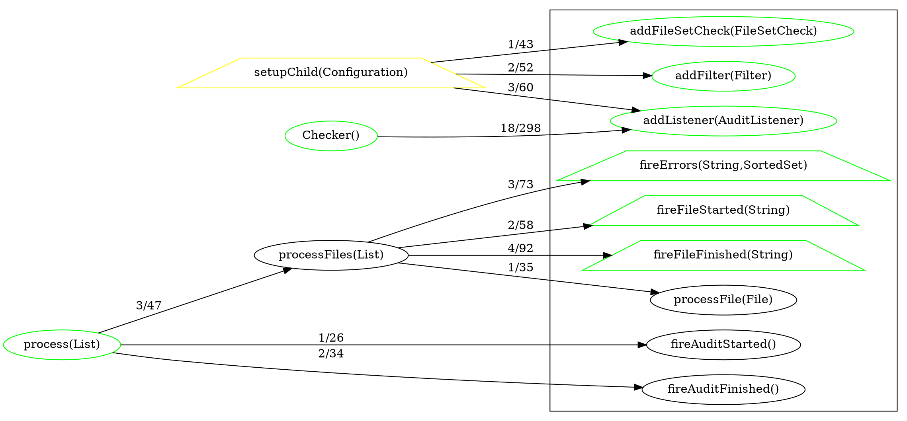

[](https://travis-ci.org/sevntu-checkstyle/methods-distance)
[](https://ci.appveyor.com/project/Checkstyle/methods-distance/branch/master)

Running:
- clone sources
- compile:
```
mvn package
```
- run
```
java -jar methods-distance/target/methods-distance-dsm-1.0-SNAPSHOT-jar-with-dependencies.jar path/to/sources/InputFile.java
```
This will produce files 'InputFile.java.html' and 'InputFile.java.dot' in working directory.

Alternatively you can try to use web service for generating these files.
Web service is hosted at [herooku](https://method-graph.herokuapp.com/).
To get .html file perform GET request at /dsm uri with parameter source_url pointing to
url of Java source file. For example:
```
https://method-graph.herokuapp.com/dsm?source_url=http://site/HelloWorld.java
```
To get .dot file perform GET request using /dot uri with parameter source_url:
```
https://method-graph.herokuapp.com/dot?source_url=http://site/HelloWorld.java
```

Output .html file will contain design structure matrix of dependencies between methods.
This matrix looks like [this](checkstyle/src/main/java/com/puppycrawl/tools/checkstyle/Checker.java) java file:


Output .dot file will contain graph of method dependencies in .dot format that can be visualized by many viewers.
Viewers:
* [Viz.js - online viewer](http://mdaines.github.io/viz.js/)
* [XDot](https://github.com/jrfonseca/xdot.py)

As an example, here is the output for [this](checkstyle/src/main/java/com/puppycrawl/tools/checkstyle/Checker.java) java file:

This graph looks like this:

